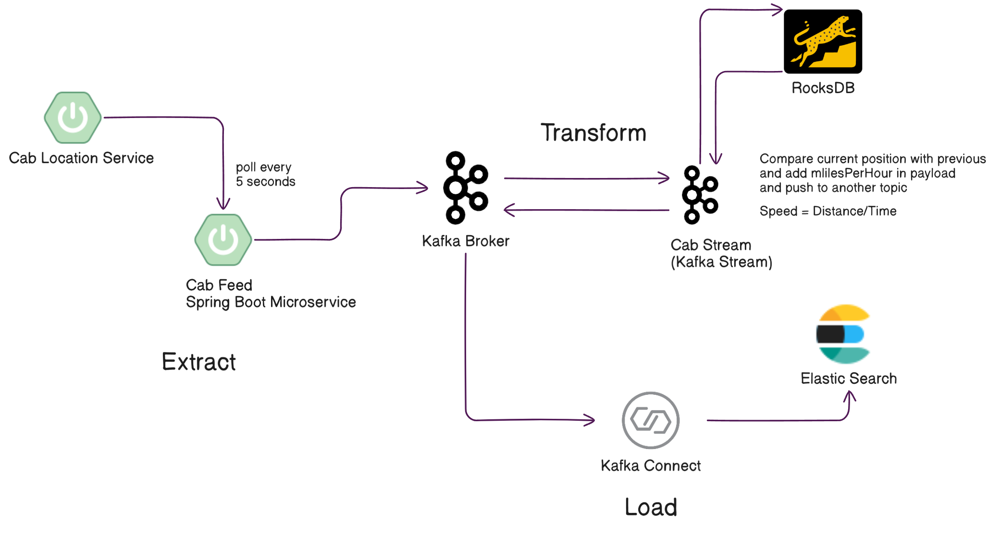

# Read Me First
This Project is an ETL (Extract, Transform & Load) for Cab Location tracking and represent data in Kibana Dashboard for analytics.

# Tech Stack Used
Java 23, Spring Boot 3.4, Kafka(Broker, Kafka Connect, Schema Registry for AVRO)

# Getting Started
Build project first by using below command
mvn clean install -DskipTests

# Sequence of project
1. (Expose Api) Start cab-location-service to expose rest api that return cab location payload.
2. (Extract) Start cab-feed which is scheduler that capture data from cab-location-service and push to kafka.
3. (Transform) Start cab-stream which will stream data from topic, transform it and push it to another kafka topic.
4. (Load) Execute elasticsearch-sink.json to load data from topic to elastic search.

### Before ingesting data into elastic search create mapping and add a new field of type geo_point and map with location field
PUT /live-cab-position-enriched
{
    "mappings": {
        "properties": {
            "location": { "type": "geo_point" }  // ✅ Correct geo_point mapping
        }
    }
}

### Sink Connector Execute
curl -X POST -H "Content-Type: application/json" --data @Git\ Repos/iot-telemetry/elasticsearch-sink.json http://localhost:8083/connectors

Check Sink Connector Status: http://localhost:8083/connectors/elasticsearch-sink/status

### Check Schema Registry Status
http://localhost:8081/subjects

### Check all available indices
GET _cat/indices?v

### Check field mappings/datatype of index
GET /live-cab-position-enriched/_mapping